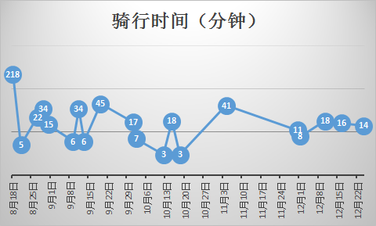
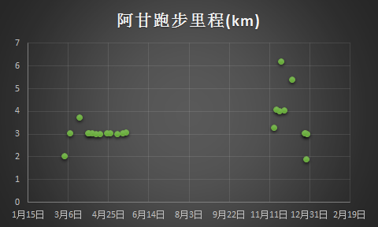
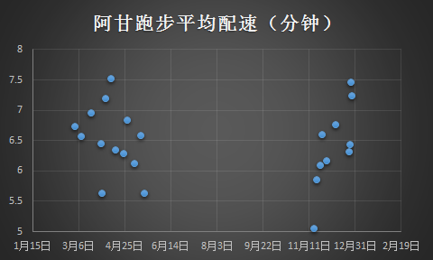
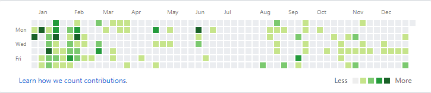

# 晒一晒2017年的部分数据

## 2017年12月31日

## 经济方面

### 学生卡和中银卡

学生卡消费主要是食堂吃饭和学生超市购买生活用品。

| 月份 | 学生卡消费 | 中银卡支出 | 中银卡收入 |
| :-- | :-- | :-- | :-- |
| 1月 | ￥353.8 |  |
| 2月 | ￥400.3 |  | 
| 3月 | ￥869.35 |  |
| 4月 | ￥808.33 | ￥802  | ￥2780
| 5月 | ￥767 | ￥752 | ￥911
| 6月 | ￥628.45 | ￥620 | ￥2622.2
| 7月 | ￥214.4 | ￥172 | ￥1360
| 8月 | ￥320.15 | ￥5827 | ￥4000
| 9月 | ￥827.95 | ￥977 | ￥538.5
| 10月 | ￥810.71 | ￥852 | ￥11220
| 11月 | ￥983.45 | ￥1002 | ￥5410
| 12月 | ￥845.95 | ￥2898.46 | ￥7462.43

*   花费少的时候只能说明我不在学校。
*   单次花费最多的时候是交一年的学费￥5000。
*   一般情况是学生卡消费与中银卡支出持平。
*   学生卡平均消费水平在￥900左右，如果只按食堂餐饮算的话平均每天￥30。
*   收入的主要来源上半年是学生助理工工资和父母转账，下半年是博士生补助、深研院补贴、助教岗工资。

### 淘宝和京东

*   买私人用品上淘宝，公家消费上京东。
*   单次消费最高是11488￥，购买MacBook Pro（公）。

## 运动方面

### 摩拜单车共骑行74.5km：

第一次骑行时间最长是在青岛环海骑了很多公里。

### 阿甘跑步

*   大四补修体育课的原因开始用这个app
*   两次单次跑步超过5公里都是跟着Runislove跑团被带出来的
*   本年度共跑了约76.79公里

## 开发方面

### GitHub
    

*   365天中有249天提交过代码
*   今年寒假搞 [DeutschLernen](https://github.com/Leidenschaft/Deutsch-Lernen) 项目导致每天提交的代码有的显示是深绿色
*   本学期因为周四上午助教工作的原因，几乎每周四都提交代码