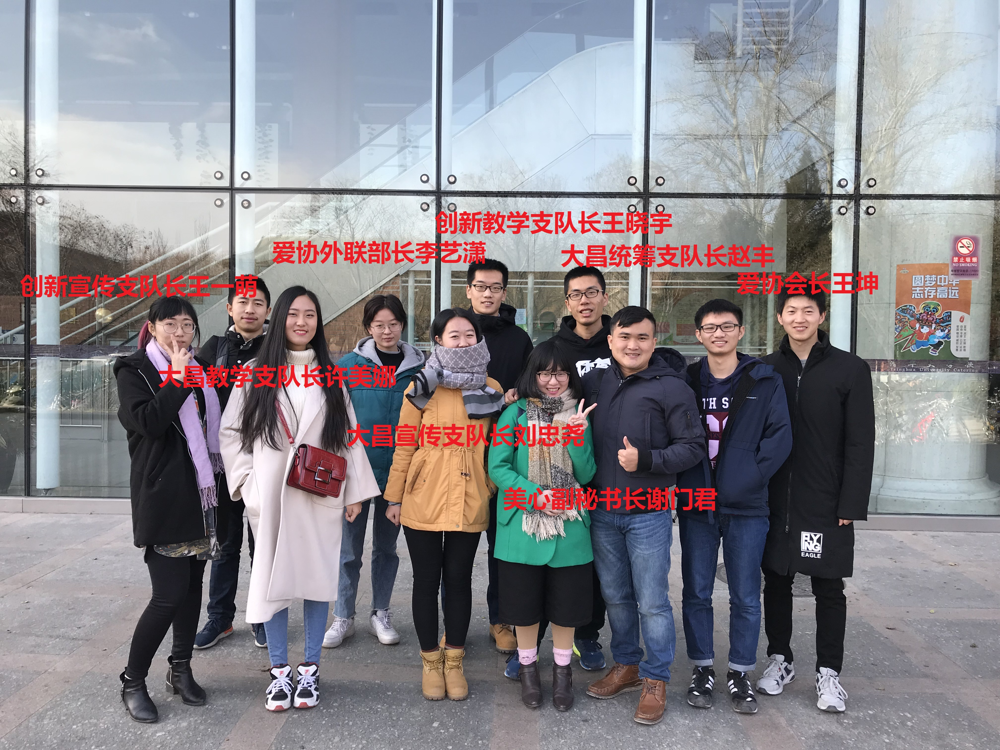
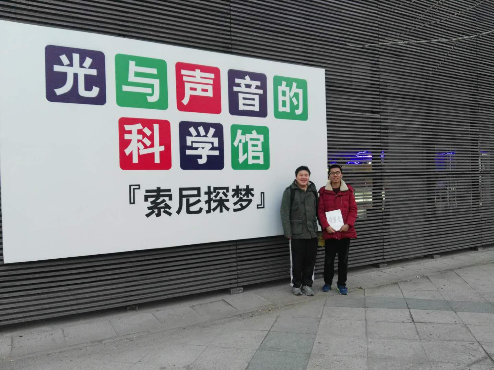
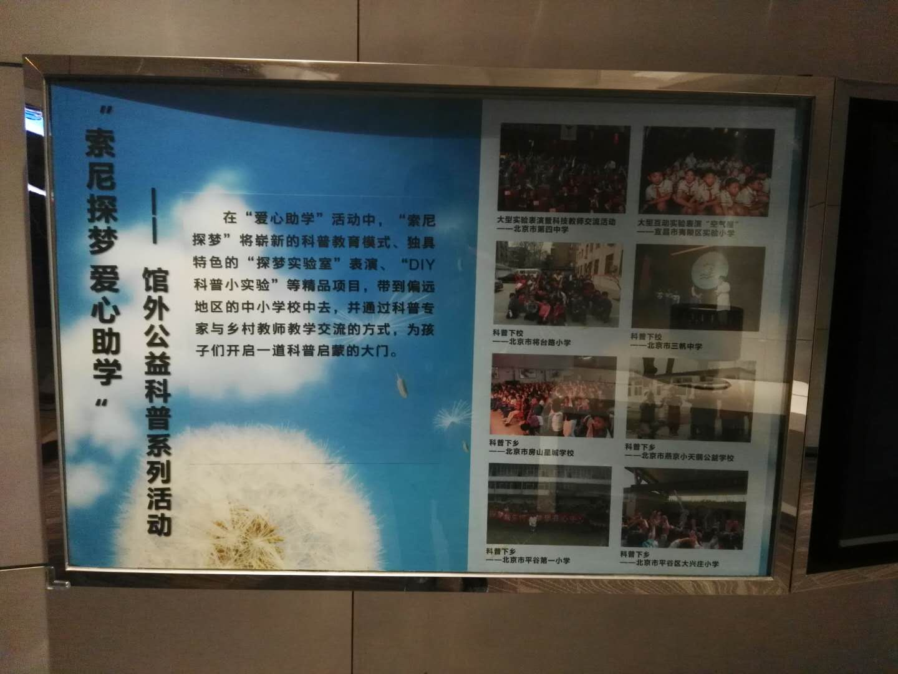
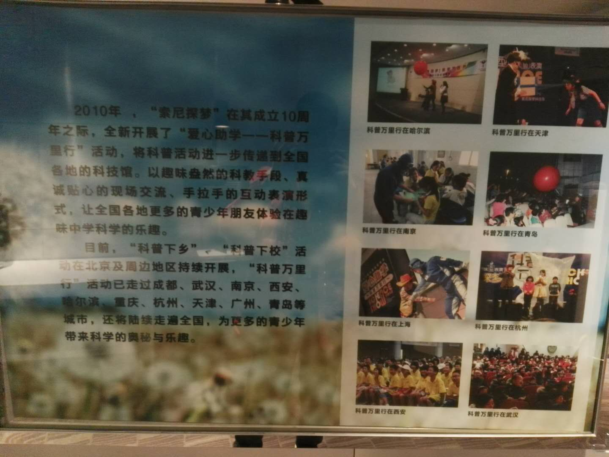

# 元旦志愿、旅游收获
## 2018年1月1日

## 参加爱协与美心副秘书长的会餐

2017年12月30日，爱协会长王坤、海南支教两支实践队伍的支队长与美在心灵副秘书长谢门君及协会的两位同学在万人食堂进行了会餐。
双方就各自关心的问题交换了意见。支队长方面希望能更多的了解关于此次实践美心那边的组织情况以便更好的开展接下来的活动。
谢老师希望参与此次海南支教的志愿者能通过学生档案的方式将对同一所学校的某些学生的关怀传承下去。具体说来即通过家访、课堂教学
中的发现以及通过从任课老师那里的了解对学生的学习和成长方面有一个书面的记录，第二年将这份记录移交给新的参与这次活动的志愿者。

此外谢老师还提出希望参与此次海南支教的志愿者能够有针对性地开展一些社会实践的调查，比如对留守儿童的调查中，形成有深度的调研报告。
这也会有助于参与各类评奖为之后的活动争取更多的人力和财力的支持。

餐后集体合影照：

针对谢老师所提的两点宝贵建议，我个人的看法是： _学生档案对于下一届参与的志愿者作用有限，并且这种重点帮扶是否
会带来公平性上的问题也值得商榷，能开展社会实践的调查固然是好事，但支教活动时间较短，志愿者面临备课与讲课的任务可能抽不出时间，
如果支队长有时间的话当然可以考虑作一些简单的调查，但支队长也有维护”志愿者之家”（志愿者排班、换岗休息、开会的地方）等任务。
去年李艺潇他们家访的经验就是准备不足。我在这一点上也有切身体会，今年暑假参加青岛中车四方专业实践。之前研究生院副院长张伟希望
我们做一点实践调查方面的工作，突出“中国工程的故事和中国工程人的故事”。但四方那边大家都有课题要搞，加上开题、中期和答辩三轮
检查，大家主要在忙自己的课题，对企业实践调查方面积极性不高。虽然中间通过人力资源部安排了几次采访（不是全员参与）和讲座，但
由于事前准备不足和事后写稿子太拖等原因，最后的实践调查报告也不了了知。所以，我觉得如果打算做这方面的调研，事前和事后支队长要多
辛苦一下，也不需要搞得太学术，能多多借鉴相关的实地调查资料最好。_

## 参加北京青檬志愿北京西站导引服务

今天上午，我6:45到北京西站的“志愿者之家”，在青檬志愿北京西站负责人 [马成朋](温暖蓝马甲.html) 老师的指导下，
了解了西站地区志愿服务相关的情况。北京西站志愿者服务协会通过和多家志愿团体合作，实现了西站接近365天的全天候不断岗的志愿服务工作。
青檬志愿协会是其中的一家。

我结合自己在“志愿者之家”阅读的2016年春运志愿服务的相关资料，收集了几点也许可以有所借鉴的地方：

* 志愿者签到和签退，之前学校十一讲解用过人工的方法，这边用手机app *志愿汇* 完成。通过输入项目识别码保证签到不能乱入。
* 中间休息都在志愿者之家，方便讨论。
* 饮水保障方面，小屋里有饮水机和泡面，但一些志愿者不习惯吃泡面，也可以用微波炉加热自己带的饭。
* 监督机制，北西站志愿联合会会有专人中途监督青蒙志愿者和和谐百姓志愿者是否在岗。
* 留言照片墙，小纸片贴成心的形状，这个是物业公司做的。
* 服务手册打印，马老师会让新人上岗前先大体浏览一下志愿服务手册。
* 上岗穿西站的会服（不是青檬的），并佩戴志愿服务证（志愿北京）。

## 参观索尼探梦科技馆

今天下午和朋友一起到朝阳公园旅游，参观了索尼探梦科技馆：

通过这次体验，我不仅体验到了各种有趣的科学小实验，还了解到了索尼（中国）在企业社会责任(csr) 方面做出的一些努力：

通过这次体验，我也比较认同索尼（中国）在对小朋友的科普方面的努力。

通过玩具和生活中科学小实验多种方式揭示背后的道理，提高小朋友探索发现未知和制作的能力。

在支教活动中，给支教学校购买玩具开销太大，而让志愿者能利用起身边的物品准备科学小实验难度又太大，这些现实的困难确实一时
半会解决不了。

