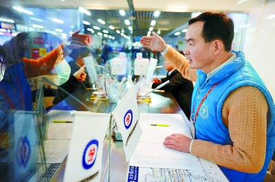
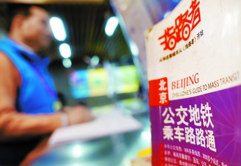
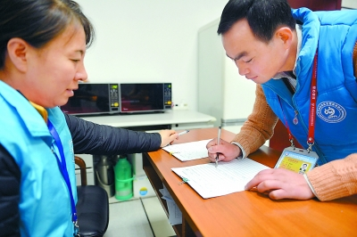
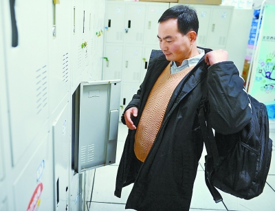
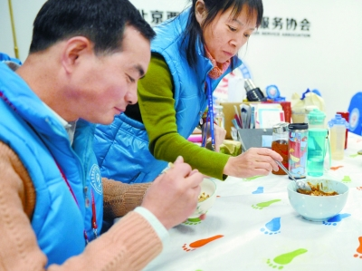
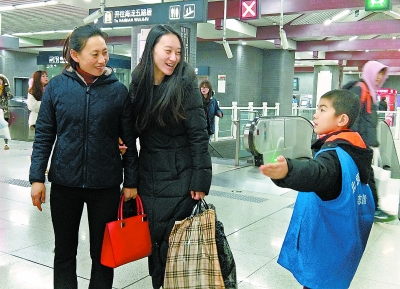

# 温暖蓝马甲
## 来源：北京晚报
## 2017年12月26日
## 版次： 32
## 作者：北京晚报记者安旭东

志愿服务期间，操着一口并不标准的普通话，马成朋在西站地区几乎一刻不停地要为过往旅客解答问题。

北京的公交、地铁换乘线路马成朋已经烂熟于心，北京西站地区志愿服务协会为志愿者配发的指路指南他现在几乎不用看。

西站地区志愿者需要签到和签退，严格的申报制度以防空岗的出现。

上午的志愿服务结束，马成朋匆忙换上衣服赶往下一个志愿服务点。

为了节省外出吃饭耽误的时间，志愿者们大多自己带饭。

马成朋9岁的儿子马珣睿作为小志愿者已经可以独立上岗。

早晨不到7点，马成朋从家准时赶到北京西站，换上蓝马甲开始了自己志愿者的一天。为旅客指路、搬行李、推轮椅，一直到下午一点钟结束西站地区的志愿服务，两点前赶到地铁北海北站，作为志愿者继续服务到下午五点。这就是志愿者马成朋一个普通的周末生活，这样的志愿者生活他已经坚持了7年。

今年41岁的马成朋的家乡在安徽无为，2003年家乡发水，经过亲戚介绍来北京打工。初到北京一下火车就找不到方向的马成朋求助一位西站地区工作人员借到电话得以给家人报了平安并联系上了北京的亲戚，这一个小小的帮助成为马成朋日后做志愿者的起因。

马成朋在北京先后做过服装厂工人、商场服装导购、服装厂销售。这期间得到不少北京人的帮助。交不起房租时房东主动给他延期，有困难时朋友们帮忙，他也用另一种方式回报北京的热情——做一名志愿者。2007年厂里的一次慈善活动让他接触到了志愿者群体，从此马成朋就成为志愿者的一员。去盲文图书馆帮助盲人，关爱自闭症儿童，去敬老院做义工……2013年，他听说北京西站地区招募志愿者，马成朋第一时间报名参加，成为西站地区的第一批志愿者。不光自己做志愿者，马成朋的妻子和两个孩子也都在他的影响下加入到了志愿者的队伍。来北京十几年，马成朋的生活逐步改善着，但最大的收获还是志愿者的生活，做志愿者让马成朋对北京有了更多的了解。不管是作为打工者还是志愿者，包容是他对北京最大的感受，他觉得付出总有回报，对一个人是这样，对一座城市也是如此。

如今西站地区志愿项目注册志愿者已经有两千多人，马成朋依旧每周都来这里做志愿服务，因为这里是他来北京第一个接受帮助的地方，曾经迷失在火车站的经历也让他知道谁最需要帮助。他要让自己的热情温暖每一个初到北京的人。