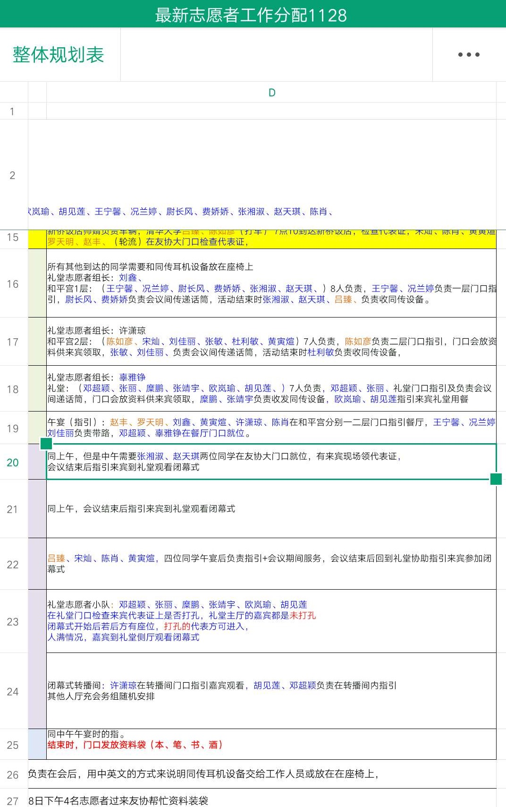

# 场务人员

举办一个新生趣味运动会，在紧张的比赛中，如何考虑到场务人员的感受是一个较难的问题。即使比赛很精彩，负责人本身如果被比赛所吸引的话，有限的精力分给了拔河比赛的精彩本身，统筹照顾其他方面可能就少了。

对比张晓冰和陈阳阳组织活动可以看出一些端倪：陈阳阳是破冰活动的组织者，她在现场活动中没有被精彩的PK环节分散注意力，最后通过裁剪而不是取消后面的环节来控制结束时间，以及提醒后台的我注意切换PPT等。张晓冰是趣味运动会的组织者，场前预估“两小时就搞完”，主持吃西瓜比赛有点占时间而取消了夹乒乓球、呼拉圈两个项目。

在任务分配方面，两个人差别也比较明显。在“破冰”项目中陈阳阳提前4个小时到达活动场地布置会场，召集了我、黄熹之（场务）、路辰（男主持）、赵露（女主持）【排名按到场先后】。其他人的分工我不是很清楚，但我在这4个小时确实没闲着，完成了打扫教室、购买电池和一箱水、搬椅子至指定位置、打印班级座位表、PPT增加座位分布（按班级）、微调座位分布、PPT增加随机数产生的宏（失败）、PPT去动画（未用）。所有的Task 都是陈阳阳安排的，干完一件去干下一件。黄熹之也领到了很多类似的任务。趣味运动会中，虽然也是提前差不多4个小时到达操场，共完成了搬运物资、场地借用、音响借用、遮阳棚借用、物资清点等事情。中午在食堂吃完饭后张晓冰、我和黄熹之都回去休息了1个小时。等我们再到操场时，已经快要开始了。记分的同学（杨明慧）和记时的同学是临时安排的，和策划里的人不太一样。比赛过程中，很多辅导员也来观战，张晓冰基本没让他们做什么。这一点很难做到，我在组织支教中以及陈阳阳在破冰活动中都有欠缺。

在情感方面，“破冰”项目中陈阳阳本人在现场也完成了很多筹备的任务，最后她为了赶时间，亲自主持抽奖环节、你画我猜环节；活动结束后对场务人员表示感谢。趣味运动会诸如音响、遮阳棚、物资清点（比如发令枪和记时器）都是下面的人考虑到并负责的；张晓冰主要是指挥大家搬东西；活动结束后忘了对场务人员表示感谢。

结合我之前的经历，给出一份示例分工明细供参考：

在上学期的半程马拉松活动中，志愿者领队李志超也做了类似的分工明细，但我觉得在情感方面他还做得不够好，对于一个可能比较无聊的时间持续较长的任务，可以考虑安排两个人轮流负责。诸如趣味运动会分工还有很多可改进之处，比如没有人安排大家净场等。

结合以上两个活动，特提出如下建议：

1. 制作简易版分工明细，让大家知道活动前几小时+活动中+活动后大家要干什么，重点是活动中。分工明细中含场内秩序维持、场地卫生保持、物资搬运安排等。
2. 不要光指挥不干活，如果时间允许的话可以考虑给场务人员拍一些照片。
3. 控制好活动时间，如有必要精简之后的流程。